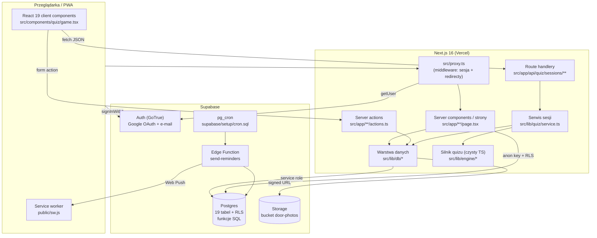

# ARCHITECTURE

## High-level

Monolit Next.js 16 (App Router) hostowany na Vercelu + Supabase jako backend
(Postgres, Auth, Storage, Edge Functions). **Nie ma osobnego serwera API** —
logika serwerowa to server componenty, server actions i route handlery w tym
samym projekcie. Reguły gry (punktacja, walidacja odpowiedzi, limity) są
wykonywane w **funkcjach SQL** wewnątrz Postgresa.



## Frontend

- **React 19 + App Router.** Domyślnie server components; `"use client"`
  tylko tam, gdzie potrzebna interakcja: `src/components/quiz/game.tsx`
  (cała gra), formularze (`*-form.tsx`), `src/app/admin/tabs.tsx`,
  `push-toggle.tsx`, strony logowania/rejestracji.
- **Stan:** brak biblioteki (Redux/Zustand). Stan serwerowy = fetch w server
  components + `revalidatePath()` po server actions. Stan gry żyje lokalnie
  w `game.tsx` (`useState`/`useRef`) — lista pytań, indeks, feedback, timer.
- **Style:** Tailwind v4 bez pliku konfiguracyjnego; tokeny i animacje
  w `src/app/globals.css` (`--color-dre-*`, `--animate-*`). Primitywy UI
  w `src/components/ui/` (`Button`, `Card`, `Chip`, `Input`/`Textarea`/`Select`,
  `Progress`, `Spinner`).
- **Layouty:** `src/app/layout.tsx` (root, manifest PWA), `src/components/app-shell.tsx`
  (górny pasek + dolna nawigacja mobilna, ikona panelu dla adminów),
  `src/app/admin/layout.tsx` (osobny shell panelu).

## Backend (w ramach Next.js)

Trzy ścieżki wykonania po stronie serwera:

1. **Server components** — czytają dane bezpośrednio przez `src/lib/db/*`
   (service role) lub przez klienta z sesją użytkownika (`createSupabaseServerClient`)
   dla danych chronionych RLS. Wszystkie strony dynamiczne
   (`export const dynamic = "force-dynamic"`).
2. **Server actions** (`src/app/**/actions.ts`) — mutacje z formularzy:
   onboarding, ustawienia, panel admina. Wzorzec: walidacja `zod` →
   guard (`assertAdmin()` w panelu) → zapis service role → `revalidatePath`.
3. **Route handlery** (`src/app/api/quiz/sessions/**`) — JSON API dla gry,
   wołane z `game.tsx`. Wszystkie owinięte w `withApi()` z `src/lib/api.ts`
   (mapowanie wyjątków na kody HTTP) + `requireUser()`.

### Kontrakt API gry

| Metoda i ścieżka | Body / params | Zwraca | Uwagi |
|---|---|---|---|
| `POST /api/quiz/sessions` | `{mode, categories?, category?, resume?}` | `SessionStart` (`sessionId`, `mode`, `total`, `answered`, `correct`, `xpEarned`, `resumed`, `questions[]`) | tworzy sesję i **prefetchuje wszystkie pytania**; `resume` = wznowienie |
| `POST /api/quiz/sessions/[id]/served` | `{position}` | `{ok:true}` | beacon „pytanie wyświetlone” — startuje pomiar czasu |
| `POST /api/quiz/sessions/[id]/answers` | `{position, answer}` | `AnswerResult` (werdykt, XP, combo, status sesji) | jedno RPC `submit_answer` |
| `POST /api/quiz/sessions/[id]/extend` | — | `{questions[]}` | dogrywka partii wyzwania (wołana w tle) |
| `POST /api/quiz/sessions/[id]/finish` | — | `{summary, comment}` | RPC `finish_session` |
| `GET /api/quiz/sessions/[id]/questions/[seq]` | — | `ServedQuestion` | **DEPRECATED** — nieużywane po przejściu na prefetch (TD-001) |

`answer` przyjmuje trzy kształty: `{value: "TAK"|"NIE"|"LEWE"|"PRAWE"}`,
`{index: 0..3}`, `{timeout: true}` (auto-oddanie po czasie) —
`answerValueSchema` w `src/lib/engine/types.ts`.

## Database

Postgres w Supabase; 19 tabel, 12 migracji, ~18 funkcji SQL. Pełny opis:
`DATA_MODEL.md`. Kluczowe zasady:

- **RLS deny-by-default.** Tabele z odpowiedziami (`door_models`, `features`,
  `model_features`, `theory_questions`, `session_questions`, `daily_quiz`)
  oraz `app_settings` mają RLS włączony **bez żadnych polityk** → czyta je
  tylko service role.
- **Reguły gry w SQL.** `create_session`, `mark_question_served`,
  `submit_answer`, `append_questions`, `finish_session` to `SECURITY DEFINER`
  z `revoke execute ... from public, anon, authenticated` — wywoływalne
  wyłącznie przez service role z serwera Next.
- **Rankingi** to funkcje SQL wołane klientem z sesją użytkownika
  (`get_leaderboard`, `get_company_leaderboard`, `get_challenge_leaderboard`,
  `get_daily_quiz_leaderboard`) — zwracają zagregowany JSON bez wrażliwych pól.
- **Paginacja obowiązkowa** przy pełnych odczytach (`fetchAll` w
  `src/lib/db/catalog.ts`) — PostgREST ucina odpowiedź do 1000 wierszy.

## Authentication & authorization

- **Uwierzytelnianie:** Supabase Auth. E-mail + hasło (`signInWithPassword`,
  `signUp`) i Google OAuth (`signInWithOAuth` → `/auth/callback` →
  `exchangeCodeForSession`). Sesja w cookies (`@supabase/ssr`).
- **Odświeżanie sesji i redirecty:** `src/proxy.ts` (odpowiednik middleware
  w Next 16). Publiczne ścieżki: `/logowanie`, `/rejestracja`, `/auth`.
  Ścieżki `/api/*` są wyłączone z redirectów — pilnują się same (401).
- **Autoryzacja (role):** tabela `user_roles` trzyma tylko role podwyższone;
  rola `user` jest niejawna. Warstwy sprawdzania:
  - API: `requireUser()` / `requireAdmin()` (`src/lib/api.ts`) — `QuizError`
    401/403 mapowane przez `withApi()`.
  - Strony panelu: `requireAdminPage()` (redirect) — `src/lib/admin-guard.ts`.
  - Server actions panelu: `assertAdmin()` (rzuca) — tamże.
  - SQL: `has_role('admin')` (`0008_roles.sql`) — gotowe pod RLS przyszłych
    tabel panelu.
- Rola czytana **świeżo z bazy** przy każdym żądaniu (nie z JWT), więc
  odebranie roli działa natychmiast; `getUserRoles`/`getSessionUser` owinięte
  w React `cache()` (dedupe w obrębie żądania).

## Storage

Prywatny bucket `door-photos` (`STORAGE_BUCKET` w `src/lib/env.ts`):
- zdjęcia modeli i ich lustrzane odbicia pod nazwami będącymi **hashami**
  (oryginał i lustro nieodróżnialne z nazwy),
- próbki dekorów pod `dekory/<slug>.<ext>` (nazwa dekoru nie jest tajna),
- serwowanie wyłącznie przez **signed URL** z TTL 600 s
  (`signImagePath`, `signImagePaths`).

## External services

| Usługa | Rola | Status |
|---|---|---|
| Supabase | Postgres, Auth, Storage, Edge Functions | IMPLEMENTED |
| Vercel | hosting Next.js, auto-deploy z gałęzi | IMPLEMENTED |
| Google Cloud (OAuth) | logowanie Google | IMPLEMENTED (konfiguracja ręczna, README krok 4) |
| Web Push (VAPID) | przypomnienia | PARTIALLY — kod gotowy, wdrożenie ręczne |
| GitHub Actions | import danych, nadawanie roli admina | IMPLEMENTED (`workflow_dispatch`) |

## Background jobs

Jedyny job: `supabase/functions/send-reminders/index.ts` wołany co godzinę
przez `pg_cron` + `pg_net` (`supabase/setup/cron.sql`, `5 * * * *` UTC).
Funkcja sama liczy godzinę Europe/Warsaw i wysyła: poranne przypomnienie
o wybranej przez użytkownika godzinie oraz „ratuj streaka” ok. 19:00.
Autoryzacja nagłówkiem `Bearer <CRON_SECRET>`. **Nie jest wdrożony
automatycznie** — wymaga `supabase functions deploy` i sekretów.

## Caching

- Brak zewnętrznego cache (Redis itp.).
- Strony z danymi użytkownika są `force-dynamic` (bez cache Next).
- `revalidatePath()` po mutacjach w server actions.
- React `cache()` do deduplikacji `getSessionUser`/`getUserRoles` w obrębie
  jednego żądania (`src/lib/db/server.ts`, `src/lib/db/roles.ts`).
- Prefetch po stronie klienta: cała lista pytań + preload obrazków 4 pytania
  w przód (`game.tsx`).
- Service worker celowo **nie cache'uje** zasobów (komentarz w `public/sw.js`).

## Routing

| Ścieżka | Typ | Dostęp |
|---|---|---|
| `/` | dashboard (server) | zalogowani |
| `/logowanie`, `/rejestracja` | client | publiczne |
| `/auth/callback` | route handler | publiczne (OAuth/PKCE) |
| `/onboarding` | server + action | zalogowani bez `onboarded_at` |
| `/quiz` | server (picker kategorii) | zalogowani |
| `/quiz/gra?mode=…&categories=…&sesja=…` | server → client `QuizGame` | zalogowani |
| `/ranking?t=daily\|monthly\|alltime\|challenge\|daily_quiz\|companies` | server | zalogowani |
| `/profil` | server (statystyki, odznaki, historia) | zalogowani |
| `/ustawienia` | server + action | zalogowani |
| `/admin` → `/admin/pytania` | server | tylko `admin` |
| `/admin/pytania`, `/admin/pytania/nowe`, `/admin/pytania/[id]` | server + actions | tylko `admin` |
| `/admin/proporcje` | server + actions | tylko `admin` |
| `/admin/uzytkownicy` | server + action | tylko `admin` |
| `/api/quiz/sessions/**` | route handlery | zalogowani (401 bez sesji) |

## Security boundaries

1. **Przeglądarka ↔ serwer Next:** klient dostaje payloady pytań BEZ
   poprawnych odpowiedzi i bez ścieżek w Storage (tylko signed URL).
2. **Serwer Next ↔ Postgres:** dwa tryby — klient z sesją użytkownika
   (podlega RLS, używany do profilu/rankingów) i klient service role
   (`createAdminClient`, tylko w `src/lib/db/*` i `src/lib/quiz/service.ts`,
   pliki oznaczone `server-only`).
3. **Klucz service role** nigdy nie trafia do bundla klienta (brak prefiksu
   `NEXT_PUBLIC_`, import `server-only` wymusza błąd builda przy pomyłce).
4. **Panel admina:** trzy niezależne bramki (strona, action, RLS/`has_role`).
5. **Limit czasu i punktacja** wyliczane w SQL — manipulacja klientem nie
   zmienia wyniku.

## Dependency direction

```
src/app  ──►  src/components  ──►  src/components/ui
   │                │
   ├──────────────► src/lib/quiz  ──►  src/lib/db  ──►  Supabase
   │                     │
   └───────────────────► src/lib/engine  (czysty TS, nie zależy od niczego)
```

Zasady:
- `src/lib/engine` **nie importuje niczego** z Next, React, Supabase ani
  z `src/lib/db`. Dostaje dane jako `CatalogSnapshot` i wagi jako parametr.
- `src/lib/db` i `src/lib/quiz` mają `import "server-only"` — nie mogą trafić
  do komponentu klienckiego.
- Komponenty klienckie mogą importować z `src/lib/engine` (typy, `pickComment`,
  stałe limitów) — to jest dozwolone i wykorzystywane w `game.tsx`.
- `scripts/*` mogą importować z `src/lib/engine` (np. `featureKind`,
  `foldName`), ale nie z `src/lib/db` (mają własny klient w `scripts/lib/db.ts`).

## Architectural invariants

Pełna lista w `/CLAUDE.md` („Critical invariants”). W skrócie: sekret
odpowiedzi, zgodność formuł TS↔SQL, czystość silnika, Europe/Warsaw,
prywatność zdjęć, zapisy tylko service role, spójność listy misji,
`featureKind()` jako jedyne miejsce klasyfikacji cech.

## Extension points

### Nowy typ pytania
1. Dodaj wariant do `QTYPES` i `QuestionPayload` w `src/lib/engine/types.ts`
   (+ `CATEGORY_TO_QTYPE`, jeśli ma być osobną kategorią nauki).
2. Napisz generator `genX(snapshot, state, rng, opts?)`
   w `src/lib/engine/generators.ts` i zarejestruj w `GENERATORS`;
   uwzględnij dedupe (`state.usedKeys`) i balans liter (`leastUsedIndex`).
3. Rozszerz `typeAvailability()` (pula) i — jeśli trzeba — `buildUnits()`.
4. Dodaj obsługę renderowania w `src/components/quiz/answers.tsx`.
5. **Migracja SQL:** rozszerz `check (qtype in (...))` na `session_questions`
   (`0003_quiz.sql`) — bez tego insert padnie.
6. Testy w `src/lib/engine/__tests__/generators.test.ts` + fixture.

### Nowy ekran
Katalog w `src/app/<trasa-po-polsku>/page.tsx`, server component,
`export const dynamic = "force-dynamic"` przy danych użytkownika, opakuj
w `<AppShell active="…">` (dodaj klucz do `NAV`, jeśli ma być w nawigacji).

### Nowy endpoint API
`src/app/api/**/route.ts` → `withApi(async () => { const user = await requireUser(); … })`,
walidacja wejścia `zod`, logika w `src/lib/quiz/service.ts` (nie w route).

### Nowa tabela / zmiana schematu
Nowy plik `supabase/migrations/00NN_nazwa.sql` (kolejny numer, nigdy edycja
wykonanej migracji), RLS `enable` + świadoma decyzja o politykach, blok
asercji w `supabase/tests/smoke.sql`, `./scripts/db-test.sh`, a w kodzie
tolerancja braku tabeli (`42P01`) na czas przed wykonaniem migracji.

### Nowa rola
`insert into roles (name, description)` w nowej migracji; sprawdzanie przez
`getUserRoles()`/`has_role('nazwa')`. Nie dodawaj polityk zapisu do
`user_roles` — nadawanie zostaje po stronie service role
(`scripts/grant-role.ts`, workflow „Rola admina”).

### Nowe ustawienie globalne
Klucz w `app_settings` (migracja z seedem), schemat `zod` w
`src/lib/engine/types.ts`, getter/setter przez `getSetting`/`setSetting`
w `src/lib/db/settings.ts`, pole w `/admin/proporcje` + action
z `assertAdmin()`, fallback na wartość domyślną w kodzie.
