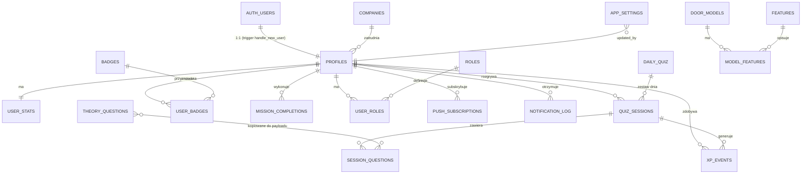

# DATA MODEL

Baza: PostgreSQL w Supabase. Schemat powstaje z 12 migracji
(`supabase/migrations/0001…0012`) wykonywanych **w kolejności numerów**.
Wszystkie tabele mają włączony RLS; różnią się obecnością polityk.

Legenda dostępu:
- **service role only** — RLS włączony, **zero polityk** → czyta/pisze tylko
  serwer kluczem service role.
- **własne (select)** — użytkownik widzi wyłącznie swoje wiersze; zapisy
  server-side.
- **publiczne dla zalogowanych** — select dla `authenticated`.

## Diagram ER

## Encje

### `companies` — firmy (ranking firmowy)
`0001_init.sql`. Pola: `id` uuid PK, `name` text NOT NULL UNIQUE,
`created_at`. Dostęp: **publiczne dla zalogowanych** (select).
Seed: „DRE”, „Inna firma” (w migracji + samonaprawa w
`src/lib/db/companies.ts` — dosiewa, gdy tabela jest pusta).
Lifecycle: tworzone ręcznie/seedem; przypisanie w profilu jest opcjonalne.

### `profiles` — profil użytkownika (1:1 z `auth.users`)
`0001_init.sql`. Pola: `id` uuid PK → `auth.users(id)` **on delete cascade**,
`display_name` text, `company_id` uuid → `companies` (nullable),
`preferred_reminder_hour` smallint NOT NULL default 8 (check 0–23),
`onboarded_at` timestamptz (null = onboarding niedokończony), `created_at`.
Dostęp: własne (select/update). Tworzony automatycznie triggerem
`handle_new_user()` (`0001`, nadpisany w `0004` — dodaje `user_stats`).
Lifecycle: rejestracja → `onboarding` ustawia `display_name`/`company_id`/
`onboarded_at`; usunięcie konta kaskadowo usuwa cały postęp.

### `door_models` — modele drzwi
`0002_catalog.sql`. Pola: `id`, `name` text UNIQUE (nazwa = nazwa pliku
zdjęcia), `collection` text (kolekcja z Excela), `original_orientation`
text check `left|right` (default `right`), `photo_original_path`,
`photo_mirrored_path`, `eligible_left_right` bool (default false),
`eligible_model_guess` bool (default true), `active` bool, `metadata` jsonb.
Dostęp: **service role only** (ścieżki zdjęć i orientacja zdradzałyby
odpowiedzi). Źródło: `scripts/import/photos.ts`.

### `features` — cechy z Excela
`0002_catalog.sql` + `image_path` z `0007_dekory.sql`. Pola: `id`,
`name` text UNIQUE, `category` text (grupa z arkusza — podstawa
`featureKind()`), `image_path` text (próbka dekoru w Storage), `active`, `created_at`.
Dostęp: **service role only**. Źródło: `scripts/import/features.ts`,
próbki: `scripts/import/dekory.ts`.
**Uwaga:** kolizje nazw między grupami rozwiązywane sufiksem kategorii
(np. „Orzech (CPL)”) — parser `scripts/lib/catalog-xlsx.ts`.

### `model_features` — macierz model × cecha
`0002_catalog.sql`. Pola: `model_id` → `door_models` (cascade),
`feature_id` → `features` (cascade), `has_feature` bool NOT NULL,
PK złożony. Dostęp: **service role only**.
Semantyka: wiersz istnieje tylko dla **jednoznacznych** komórek Excela
(`x` → true, pusta → false); komórki niejednoznaczne (`ZN`) są pomijane —
„nie wiadomo” ≠ „nie ma”. Rozmiar produkcyjny: ~39 tys. wierszy
(dlatego `fetchAll` z paginacją).

### `theory_questions` — pytania teoretyczne
`0002_catalog.sql`. Pola: `id`, `external_id` text UNIQUE (id z importu JSON),
`category` text default `teoria`, `question` text, `answers` jsonb
(check: tablica), `correct_index` smallint (check 0–3), `explanation` text,
`difficulty` smallint default 2 (check 1–3), `active` bool, `source` text
(`admin` dla wpisów z panelu), `created_at`.
Dostęp: **service role only**. CRUD: `/admin/pytania`.

### `daily_quiz` — zestaw Quizu Dnia
`0003_quiz.sql`. Pola: `id`, `quiz_date` date UNIQUE, `questions` jsonb
(pełna specyfikacja **z odpowiedziami**), `created_at`.
Dostęp: **service role only**. Lifecycle: generowany leniwie przy pierwszym
żądaniu w danym dniu (`startDailySession`), deterministycznie z seeda daty;
unikat `quiz_date` czyni to race-safe.

### `quiz_sessions` — sesja gry
`0003_quiz.sql`, check kategorii rozszerzony w `0007`/`0010`. Pola:
`id`, `user_id` → `profiles` (cascade), `mode` check `learning|challenge|daily`,
`category` check `models|technical|dekory|left_right|theory|mix` (nullable),
`status` check `active|finished|abandoned`, `daily_quiz_id` → `daily_quiz`,
`question_count`, `correct_count`, `wrong_count`, `current_combo`, `max_combo`,
`xp_earned`, `total_time_ms`, `started_at`, `finished_at`, `finalized_at`,
`summary` jsonb.
Indeksy: unikat „jedna aktywna sesja na użytkownika”
(`where status='active'`), unikat „jedno podejście do Quizu Dnia”,
indeks pod ranking dzienny.
Dostęp: własne (select). Zapisy tylko przez funkcje SQL.

### `session_questions` — pytania w sesji
`0003_quiz.sql` + `swatch_path` z `0007`. Pola: `id`, `session_id` (cascade),
`seq` int, `qtype` check `feature_yn|left_right|model_guess|theory`,
`dedupe_key` text, `payload` jsonb (**to, co widzi klient**),
`correct_answer` jsonb (**nigdy nie opuszcza serwera przed odpowiedzią**),
`explanation`, `image_path`, `swatch_path`, `served_at`, `answered_at`,
`given_answer` jsonb, `is_correct`, `time_ms`, `xp`.
Unikaty: `(session_id, seq)`, `(session_id, dedupe_key)`.
Dostęp: **service role only**.
Lifecycle: insert przy `create_session`/`append_questions` → `served_at`
(beacon) → `answered_at` + werdykt (`submit_answer`).

### `user_stats` — zagregowane statystyki
`0004_gamification.sql`. Pola: `user_id` PK, `total_xp`, `current_streak`,
`longest_streak`, `last_active_date` date, `streak_freezes` smallint,
`sessions_completed`, `questions_answered`, `correct_answers`,
`best_challenge_score`, `daily_quizzes_completed`, `category_stats` jsonb
(klucze = `qtype`, wartości `{total, correct}`), `updated_at`.
Dostęp: własne (select). `updated_at` służy też jako „ostatnia aktywność
w quizie” w panelu admina.
**Inwariant:** `total_xp` musi równać się sumie `xp_events.amount`
(sprawdzane w `smoke.sql`).

### `xp_events` — dziennik XP
`0004`. Pola: `id` bigint identity, `user_id` (cascade), `amount`,
`kind` check `answer|session_bonus|streak_bonus|badge|daily_quiz|mission`,
`session_id` → `quiz_sessions` (set null), `session_question_id` → `session_questions`
UNIQUE (set null — chroni przed podwójnym przyznaniem), `day_warsaw` date
(default: dzisiejsza data w Europe/Warsaw), `awarded_at`.
Dostęp: własne (select). Podstawa rankingów dziennych/miesięcznych.

### `badges` / `user_badges` — odznaki
`0004`. `badges`: `id` text PK, `name`, `description`, `icon`, `criteria` jsonb
(`{metric, gte}`), `xp_reward`, `sort_order`, `active`; 20 wierszy w seedzie
migracji; dostęp: **publiczne dla zalogowanych**.
`user_badges`: `(user_id, badge_id)` PK + `awarded_at`; dostęp: własne.
Przyznawanie: `finish_session` porównuje `criteria.metric` ze statystykami.

### `mission_completions` — wykonane misje dzienne
`0004`. Pola: `(user_id, day_warsaw, mission_code)` PK, `reward`,
`completed_at`. Dostęp: własne. Kody muszą się zgadzać z listą w
`src/lib/db/dashboard.ts`: `daily_goal_20`, `combo_8`, `daily_quiz_done`.

### `push_subscriptions` / `notification_log`
`0005_push.sql`. `push_subscriptions`: `id`, `user_id`, `endpoint` UNIQUE,
`p256dh`, `auth`, `user_agent`, `failed_count`, `created_at`,
`last_success_at`; dostęp: pełny CRUD na własnych wierszach (klient sam
zarządza subskrypcją). `notification_log`: `(user_id, kind, sent_on)` PK
(`kind` check `morning|streak_rescue`) — idempotencja crona; dostęp:
**service role only**.

### `roles` / `user_roles` — RBAC
`0008_roles.sql`, FK `granted_by` zmieniony w `0012`. `roles`: `name` PK,
`description`; seed: `admin`. **Rola `user` jest niejawna** — nie ma wiersza.
`user_roles`: `(user_id, role)` PK, `granted_at`, `granted_by` → `profiles`
**on delete set null** (0012). Dostęp: `roles` publiczne dla zalogowanych;
`user_roles` — select własnych, **brak polityk zapisu** (nadawanie tylko
service role: `scripts/grant-role.ts`, workflow „Rola admina”).

### `app_settings` — ustawienia globalne
`0010_settings.sql`, FK `updated_by` zmieniony w `0012`. Pola: `key` text PK,
`value` jsonb, `updated_at`, `updated_by` → `profiles` (set null).
Dostęp: **service role only**. Klucze:
| Klucz | Kształt | Domyślnie | Migracja |
|---|---|---|---|
| `question_mix` | `{models, technical, dekory, left_right, theory}` (0–100) | `{20,35,10,15,20}` | `0010` |
| `daily_quiz_size` | liczba 5–30 | `10` | `0011` |
Walidacja: `questionMixSchema`, `dailyQuizSizeSchema`
(`src/lib/engine/types.ts`); odczyt/zapis: `src/lib/db/settings.ts`
(fallback na wartości domyślne, gdy tabela/wiersz nie istnieje).

## Funkcje SQL (reguły gry)

| Funkcja | Migracja | Rola |
|---|---|---|
| `handle_new_user()` | `0001`, nadpisana w `0004` | trigger: profil + `user_stats` po rejestracji |
| `create_session()` | `0003`, nadpisana w `0007` | transakcyjny start sesji (porzuca poprzednią aktywną) |
| `append_questions()` | `0003`, nadpisana w `0007` | dogrywka partii wyzwania |
| `mark_question_served()` | `0003` | ustawia `served_at` (start pomiaru czasu) |
| `submit_answer()` | `0003` → `0006` → **`0009`** | walidacja odpowiedzi, XP, combo, limit czasu, kamień milowy |
| `rank_index()` | `0004` | próg rangi dla XP |
| `finish_session()` | `0004` | bonusy, streak, odznaki, misje, `summary`; idempotentna |
| `get_leaderboard()` | `0004` | ranking dzienny/miesięczny/od początku |
| `get_company_leaderboard()` | `0004` | ranking firm (min. 3 aktywne osoby) |
| `get_challenge_leaderboard()` | `0004` | rekordy wyzwania |
| `get_daily_quiz_leaderboard()` | `0004` | wyniki Quizu Dnia |
| `get_reminder_recipients()` | `0005` | odbiorcy push (dla Edge Function) |
| `has_role()` | `0008` | sprawdzenie roli pod RLS |

**Uwaga:** `submit_answer` istnieje w trzech wersjach jako
`create or replace` — obowiązuje ostatnia wykonana (docelowo `0009`).

## Migracje

- Brak automatu (brak Supabase CLI w pipeline). Pliki wykonuje człowiek
  w **SQL Editor** w kolejności numerów, albo `supabase db push` lokalnie.
- Nigdy nie edytuj już wykonanej migracji — dodaj nową.
- Kod aplikacji jest pisany tak, by działać **przed** wykonaniem najnowszej
  migracji (fallbacki na `42P01`/`42703`, komunikat `migration_required`).
- Weryfikacja lokalna całego łańcucha: `./scripts/db-test.sh`.

## Seed data

| Co | Gdzie |
|---|---|
| Firmy („DRE”, „Inna firma”) | `0001_init.sql` + `src/lib/db/companies.ts` |
| 20 odznak | `0004_gamification.sql` |
| Rola `admin` | `0008_roles.sql` |
| `question_mix`, `daily_quiz_size` | `0010`, `0011` |
| Dane przykładowe do gry (modele, cechy, teoria) | `npx tsx scripts/import/seed-placeholder.ts` |
| Dane produkcyjne | `scripts/import/{photos,features,theory,dekory}.ts` z `materialy/` |

## Storage

Bucket `door-photos` (prywatny, tworzony przez `ensureBucket()` w importerach):
- `<hash>.jpg` — zdjęcia modeli i lustra (nazwy nieodróżnialne),
- `dekory/<slug>.<ext>` — próbki dekorów.
Serwowanie: `signImagePaths()` (signed URL, TTL 600 s z `src/lib/env.ts`).

## Dane po stronie klienta

- **Brak** localStorage/IndexedDB na dane gry. Stan sesji trzyma serwer;
  klient ma tylko prefetchowaną listę pytań w pamięci (`useState`).
- Sesja auth: cookies (`@supabase/ssr`).
- Id aktywnej sesji w URL (`?sesja=<uuid>`) — mechanizm wznowienia po
  odświeżeniu.
- Service worker nie cache'uje odpowiedzi.
