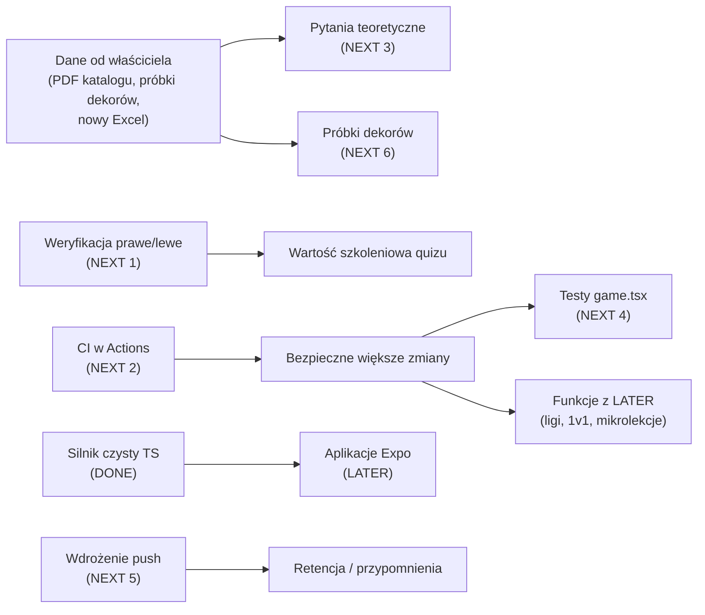

# ROADMAP

Odtworzona z: sekcji „Roadmapa (post-MVP)” w `README.md`, historii commitów
(`git log`) oraz faktycznego stanu kodu. **Nie zawiera wymyślonych funkcji** —
jeśli czegoś nie ma w repo ani w README, nie ma tego tutaj.

Etapy F0–F6 pochodzą z pierwotnego planu MVP; ich zawartość odtworzono
z commitów `d5a144f`, `63b7ca3`, `4e3ce83`.

## DONE

| Etap | Zakres | Dowód |
|---|---|---|
| **F0** | scaffold Next + Tailwind + tokeny DRE + layout; auth (Google + e-mail) + onboarding | `d5a144f`, `4e3a84c`, `28b0a07` |
| **F1** | migracje SQL + RLS + harness testowy PG; skrypty importu + seed | `d5a144f`, `63b7ca3` |
| **F2** | silnik quizu (generatory, XP, narrator) + testy; API sesji + `submit_answer` + UI nauki | `d5a144f`, `63b7ca3` |
| **F3** | tryb wyzwanie (survival) | `63b7ca3` |
| **F4** | grywalizacja: `finish_session`, streaki, odznaki, rankingi | `4e3ce83` |
| **F5** | Quiz Dnia + misje dzienne | `4e3ce83` |
| **F6** | PWA + kod Web Push + szlif | `4e3ce83` |
| — | import realnych danych DRE (parser Excela, aliasy kolekcji, workflow w Actions) | `bb5fae5`, `5400d79`, `359558a`, `c341558` |
| — | UX runda 1: prefetch pytań/obrazków, losowe dystraktory | `e192317`, `b6b7f2b` |
| — | dekory jako osobna kategoria + grafika przy pytaniach o cechy | `dcdf4ba` |
| — | UX runda 2: multi-wybór kategorii, wznowienie sesji, widoczne statystyki | `ac2290f` |
| — | gramatyka pytań technicznych (26 szablonów) + wznowienie tylko przez `?sesja=` | `e9881c4` |
| — | wariant ABCD pytań o cechy | `01a8a59` |
| — | onboarding: firma opcjonalna + samonaprawa listy firm | `9696227` |
| — | fix paginacji katalogu (limit 1000 wierszy PostgREST) | `5b20f09` |
| — | system ról (RBAC) + panel admina (pytania, użytkownicy) | `9f49f81`, `9d728ce` |
| — | UX runda 3: bottom-sheet, szybszy werdykt, limit czasu 20/12 s, ekran bez przewijania | `b15a89f`, `bc1b5b9` |
| — | globalne proporcje pytań + długość Quizu Dnia (panel) | `562b270`, `bcdcd99` |
| — | usuwanie konta z całym postępem (testowanie rejestracji) | `3edf8a9` |
| — | dokumentacja dla agentów (`CLAUDE.md`, `docs/**`) | ten commit |

## CURRENT

- **Iteracje na feedbacku właściciela produktu.** Cykl: użytkownik testuje na
  telefonie → zgłasza listę poprawek → agent implementuje, testuje, wypycha,
  podaje ewentualną migrację do wklejenia.
- **Domknięcie danych**: weryfikacja kierunku prawe/lewe, treść pytań
  teoretycznych, próbki dekorów. Zależności i właściciele: `STATUS.md`.

## NEXT

Kolejność wynika z ryzyka i zależności:

1. **Weryfikacja prawe/lewe** (blokuje wartość jednej z czterech kategorii;
   naprawa = ponowny import z `orientacja: left`).
2. **CI w GitHub Actions** — `npm test`, `lint`, `typecheck`, `build` na
   push/PR (dziś zero automatycznej ochrony; TD-004).
3. **Pytania teoretyczne z katalogu DRE** (zależy od dostarczenia PDF).
4. **Testy `src/components/quiz/game.tsx`** (największe skupisko logiki bez
   testów; TD-005).
5. **Wdrożenie Web Push** (Edge Function + VAPID + pg_cron) — kod gotowy.
6. **Próbki dekorów** (zależy od plików graficznych od właściciela).

## LATER

Z README („Roadmapa (post-MVP)”) — brak kodu, brak decyzji o terminie:

- mikrolekcje „Podstawy” (dawka wiedzy + minitest),
- powtórka błędów / spaced repetition,
- tryb „60 sekund”,
- ligi tygodniowe i sezony,
- pojedynki 1v1,
- statystyki dla trenerów (które modele mylą się najczęściej),
- aplikacje natywne **Expo** na tym samym backendzie (silnik już przenośny —
  ADR-002),
- rozszerzenie panelu admina: nadawanie ról z tabeli użytkowników, podgląd
  szczegółów użytkownika, wyłączanie modeli z pytań prawe/lewe, edycja firm
  (zaproponowane w rozmowie, brak decyzji).

## UNDECIDED / REQUIRES DECISION

- **Ostateczne nazwy rang** (w kodzie: „nazwy robocze — do akceptacji przez DRE”).
- **Znaczenie komórek `ZN`** w arkuszu cech (obecnie pomijane).
- **Polityka rejestracji** — dziś otwarta dla każdego e-maila; czy ograniczyć
  do domen firmowych?
- **Kolekcje GALLA / REZZO** — czekają na nowszy Excel.
- Czy Quiz Dnia ma mieć osobne proporcje niż tryby swobodne (dziś wspólne).

## Zależności między etapami

