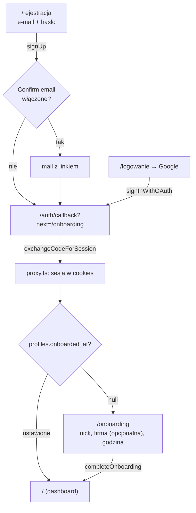
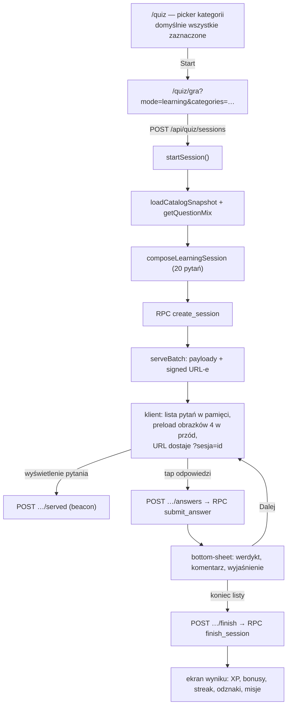

# USER FLOWS

Wszystkie przepływy opisane na podstawie kodu. Status per flow na końcu sekcji.

## 1. Rejestracja i pierwsze wejście

- **Trigger:** wejście na `/rejestracja` albo `/logowanie`.
- **Kroki i moduły:** `src/app/(auth)/rejestracja/page.tsx` (client,
  `supabase.auth.signUp` z `emailRedirectTo=/auth/callback?next=/onboarding`),
  `src/app/(auth)/logowanie/page.tsx` (`signInWithPassword` lub
  `signInWithOAuth({provider:"google"})`), `src/app/auth/callback/route.ts`
  (`exchangeCodeForSession`), `src/proxy.ts` (redirecty), `src/app/onboarding/*`.
- **Zmiany danych:** trigger `handle_new_user()` tworzy `profiles`
  + `user_stats`; `completeOnboarding` ustawia `display_name`, `company_id`
  (może być `null`), `preferred_reminder_hour`, `onboarded_at`.
- **Edge cases:**
  - błąd OAuth → powrót na `/logowanie?blad=auth&opis=…` z bannerem
    (`callback/route.ts`);
  - brak firm w bazie → `listCompanies()` dosiewa „DRE”/„Inna firma”;
  - wybór firmy jest **opcjonalny** (można pominąć i uzupełnić w Ustawieniach);
  - zalogowany na `/logowanie` → redirect na `/` (`proxy.ts`).
- **Status:** IMPLEMENTED. („Confirm email” w Supabase to ustawienie
  projektu — poza repo, `UNKNOWN` jak skonfigurowane na produkcji.)

## 2. Sesja nauki (główny przepływ gry)

- **Trigger:** `/quiz` → wybór kategorii → „Start”.
- **Moduły:** `src/app/quiz/page.tsx`, `src/components/quiz/learning-picker.tsx`,
  `src/app/quiz/gra/page.tsx`, `src/components/quiz/game.tsx`,
  `src/lib/quiz/service.ts`, `src/lib/engine/generators.ts`,
  funkcje SQL `create_session`/`mark_question_served`/`submit_answer`/`finish_session`.
- **Zmiany danych:** `quiz_sessions` (+ `session_questions`), przy każdej
  odpowiedzi `session_questions` + `quiz_sessions` + `user_stats` + `xp_events`,
  na koniec bonusy, `user_badges`, `mission_completions`, `summary`.
- **Kluczowe zachowania:**
  - **prefetch** — cała lista pytań przychodzi na starcie (bez odpowiedzi),
    przejścia są lokalne, obrazki ładowane z wyprzedzeniem;
  - **limit czasu** 20 s (nauka/Quiz Dnia) — pasek + licznik; po upływie
    klient sam wysyła `{timeout:true}`, a SQL i tak odrzuca odpowiedzi po
    limicie (+3 s zapasu na sieć);
  - **komentarz narratora** liczony na kliencie (`pickComment`), by werdykt
    wymagał jednego zapytania do bazy.
- **Edge cases:** `too_fast` (<250 ms) → można odpowiedzieć ponownie;
  brak `served_at` (wyścig beacona) → brak bonusu i brak kary; pusta baza →
  komunikat „Baza pytań jest pusta”; brak migracji → `migration_required`.
- **Status:** IMPLEMENTED.

## 3. Wznowienie sesji po odświeżeniu

- **Trigger:** odświeżenie/powrót na `/quiz/gra?…&sesja=<uuid>`.
- Klient po starcie wpisuje id sesji do URL (`history.replaceState`).
  `startSession()` wznawia **tylko** gdy dostanie `resume` i sesja jest
  `active` w tym samym trybie (`resumeSession()`); wtedy zwraca
  `resumed: true`, dotychczasowe `answered/correct/xpEarned` i pozostałe
  pytania. Wejście z pickera (bez `sesja`) zawsze tworzy nową sesję —
  `create_session` porzuca poprzednią (`status='abandoned'`).
- **Quiz Dnia** wznawia się także bez parametru (po `daily_quiz_id`), żeby
  odświeżenie nie spaliło jedynego podejścia.
- Zegar serwera nie jest resetowany — odświeżenie nie daje dodatkowego czasu.
- **Status:** IMPLEMENTED.

## 4. Wyzwanie (survival)

- **Trigger:** `/quiz` → kafelek „⚡ Survival” → `/quiz/gra?mode=challenge`.
- Partia startowa: 10 pytań (`CHALLENGE_BATCH_SIZE`). Gdy bufor się kurczy,
  klient w tle woła `POST …/extend` → `extendChallengeBatch()` odtwarza stan
  generatora z bazy (`extendChallenge`) i dokłada kolejną partię.
- Limit czasu: **12 s**. Pierwsza błędna odpowiedź (lub timeout) ustawia
  `status='finished'` w `submit_answer`. Co 10 poprawnych: +15 XP
  (kamień milowy). Rekord trafia do `user_stats.best_challenge_score`
  w `finish_session`.
- **Edge cases:** wyczerpanie puli pytań → jednorazowe zerowanie dedupe
  (`composeChallengeBatch`), żeby gra się nie kończyła z braku pytań;
  wyjście przyciskiem ✕ pyta o potwierdzenie i zapisuje wynik.
- **Status:** IMPLEMENTED.

## 5. Quiz Dnia

- **Trigger:** kafelek na dashboardzie → `/quiz/gra?mode=daily`.
- Pierwsze żądanie w danym dniu generuje zestaw deterministycznie
  (`mulberry32(seedFromString("quizdre-daily-<data>"))`), zapisuje w
  `daily_quiz` (unikat `quiz_date`), więc wszyscy grają ten sam zestaw.
  Długość: `app_settings.daily_quiz_size` (5–30, domyślnie 10);
  proporcje kategorii: `question_mix`.
- Jedno podejście: unikat `(user_id, daily_quiz_id)`; ukończony →
  `daily_already_played` i na dashboardzie „zaliczony ✓” + link do rankingu.
- Bonus za ukończenie: +25 XP; baza XP za odpowiedź: 15 (zamiast 10).
- **Status:** IMPLEMENTED.

## 6. Rankingi

- **Trigger:** zakładka „Rankingi” / przycisk z ekranu wyniku.
- `/ranking?t=<tab>` (`daily`, `monthly`, `alltime`, `challenge`,
  `daily_quiz`, `companies`) → RPC do funkcji SQL wołane **klientem z sesją
  użytkownika** (RLS), zwracają JSON z `top[]` i `me`.
- **Edge cases:** ranking firm wymaga min. 3 aktywnych osób w firmie —
  inaczej zwraca pustą listę (struktura zachowana).
- **Status:** IMPLEMENTED.

## 7. Panel admina

- **Trigger:** ikona 🛡️ w górnym pasku albo Ustawienia → „Panel admina”
  (widoczne tylko dla roli `admin`). Wejście na `/admin` bez roli → redirect `/`.
- **Pytania** (`/admin/pytania`): lista, dodanie (`/nowe`), edycja (`/[id]`),
  włącz/wyłącz (`active`), usunięcie. Walidacja `zod` (4 różne odpowiedzi,
  dokładnie jedna poprawna, trudność 1–3). Ręczne wpisy: `source='admin'`.
  Zmiany wchodzą do puli od następnej sesji; rozegrane sesje mają własne kopie
  payloadów, więc usunięcie pytania nie psuje historii.
- **Proporcje** (`/admin/proporcje`): suwaki 0–100 dla 5 kategorii + długość
  Quizu Dnia. Zapis → `app_settings`. Waga 0 wyklucza kategorię z mixu,
  wyzwania i Quizu Dnia (ale jawny wybór w nauce ma pierwszeństwo).
- **Użytkownicy** (`/admin/uzytkownicy`): tabela (e-mail, ostatnie logowanie,
  ostatnia aktywność, seria, XP + ranga, liczba odpowiedzi, celność) oraz
  **usunięcie konta** — potwierdzenie przez przepisanie adresu, blokada
  self-delete, kaskadowe czyszczenie postępu.
- **Status:** IMPLEMENTED.

## 8. Powiadomienia push

- **Trigger:** Ustawienia → przełącznik push albo karta zachęty na ekranie
  wyniku (`src/components/push-opt-in.tsx`).
- Klient rejestruje service worker i subskrypcję (`src/lib/push/client.ts`),
  zapis w `push_subscriptions` (RLS: własne wiersze).
- Wysyłka: `pg_cron` (co godzinę) → Edge Function `send-reminders` →
  `get_reminder_recipients()` → Web Push; `notification_log` zapewnia
  max 1 powiadomienie danego typu dziennie.
- **Status:** PARTIALLY IMPLEMENTED — kod kompletny, brak wdrożenia
  (Edge Function + klucze VAPID + pg_cron do uruchomienia ręcznie,
  README sekcja 5).

## 9. Import danych (właściciel produktu)

- **Trigger:** wrzucenie plików do `materialy/` (przez stronę GitHuba) →
  Actions → „Import danych quizu” → wybór zakresu i ewentualnie `proba`
  (dry-run).
- Zakresy: `wszystko`, `zdjecia`, `teoria`, `cechy (excel)`, `dekory (probki)`;
  parametr `orientacja` ustala, czy oryginały to skrzydła prawe czy lewe.
- Skrypty raportują braki (modele bez kolekcji, kolekcje bez zdjęć,
  niejednoznaczne komórki) — nic nie jest zgadywane.
- **Status:** IMPLEMENTED (wymaga sekretów repo: `SUPABASE_URL`,
  `SUPABASE_SERVICE_ROLE_KEY`).
